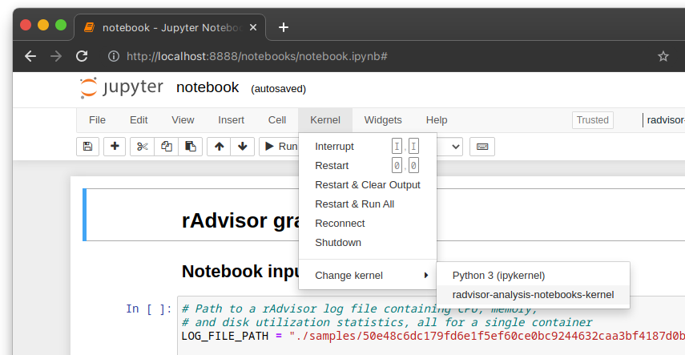
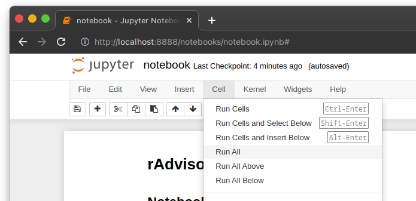
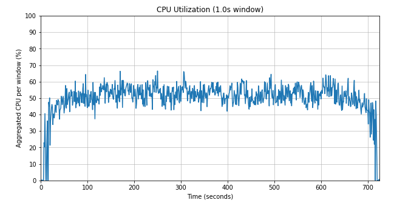
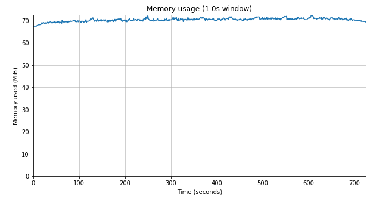
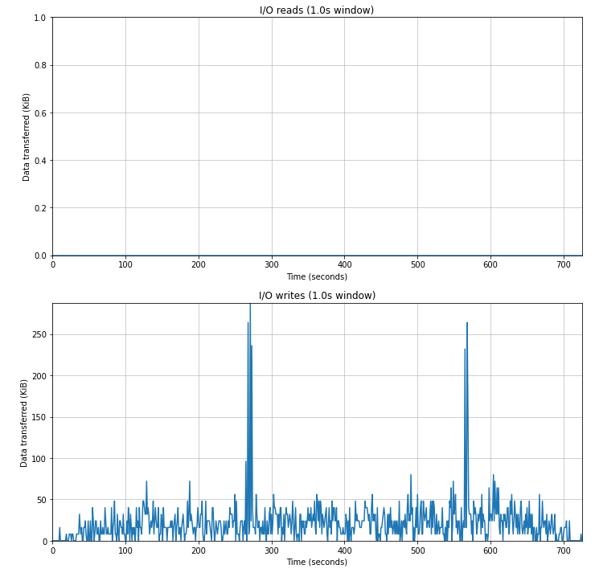
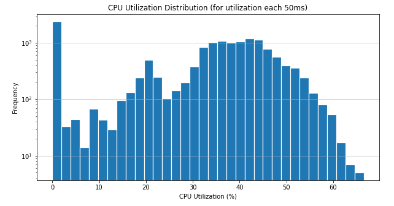
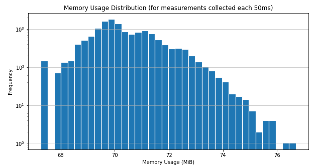
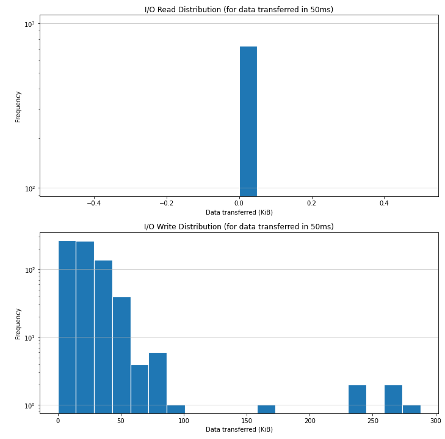

# rAdvisor analysis notebooks

This repository contains a Jupyter notebook that can be used to parse and analyze rAdvisor log files.

## ✅ Prerequisites

To run this notebook, you should already have log files that were created over the course of running an experiment
(or you can use a sample log file),
which should have names that are in the form of `{container_id}_{timestamp}.log`.
For example, `50e48c6dc179fd6e1f5ef60ce0bc9244632caa3bf4187d0b893e5ecae6d491c6_1616525638.log`
is the name of the sample log file that is given in `./samples`.

Additionally, Python **version 3.9 or above** should be installed on your computer,
which will be used to set up a virtual environment in the next step.
To check the version you already have installed, run `python --version` or `python3 --version`:

```sh
$ python --version
Python 3.9.5
```

## ⚙️ Setting up Jupyter in a virtual environment

> This section was based on [this tutorial](https://janakiev.com/blog/jupyter-virtual-envs/).
> If you have any problems running these steps, it might be useful since it contains a bit more info.

First, run the following command in the repository root to create the virtual environment:

```sh
python -m venv .env
```

Then, activate the virtual environment in the current shell:

```sh
source .env/bin/activate
```

Next, in the same terminal, install all requirements that the notebook needs,
as well as `jupyter` and `notebook`:

```sh
pip install -r requirements.txt
pip install jupyter notebook
```

Afterwards, configure Jupyter to use the python3 binary in the virtual environment:

```sh
python -m ipykernel install --user --name=radvisor-analysis-notebooks-kernel
```

Now, it should be ready to use. Start the Jupyter notebook server by running:

```sh
jupyter notebook
```

Once it is open in your browser and you have navigated to the `notebook.ipynb` file,
you might need to switch kernels to point to the one in the virtual environment.
Simply go to Kernel > Change kernel and select "radvisor-analysis-notebooks-kernel" from the list:



## 👩‍💻 Using the notebook to analyze experiment data

Once you have the notebook open in Jupyter, you're ready to start analyzing rAdvisor experiment data.
It runs on a **single container log file** at a time.
To provide it with the log file to parse, look at the "Notebook inputs" section:
specifically, the `LOG_FILE_PATH` variable.
It should contain a path (either absolute or relative to the repository root) pointing to the log file to analyze.

> Note: the default value for the `LOG_FILE_PATH` variable points to a sample log file included in this repository.
> If desired, you can also run the notebook against this data without supplying your own.

Once this is set to point to the desired log file, click Cell > Run All in the menu to run the entire notebook:



## 📊 Info about each graph and its inputs

### Point-in-time / line graphs

Each of these graphs shows point-in-time data for either CPU utilization, memory usage, or block I/O.
They all have two inputs in common:

- `WINDOW_SIZE_MS` - the size of the window to use to aggregate point-in-time samples together in order to create fewer data points.
  By default, it is `1_000`, which groups all data points into 1-second-wide windows
  (for example, if using the default 50 ms collection interval with rAdvisor, this aggregates 20 data points into a single one).
- `WINDOW_AGGREGATION_FUNCTION` - the function actually used to perform the aggregation.
  It's default value depends on the specific graph, and it accepts any function or function name
  that can be passed to [`pandas.aggregate`](https://pandas.pydata.org/docs/reference/api/pandas.Series.aggregate.html).

#### CPU Point-in-time / line graph

This graph plots the CPU utilization of the container's workload over the course of the experiment.
In addition to the 2 common inputs for every point-in-time graph, it also has an extra input: `PER_CPU_AGGREGATION_FUNCTION`.
This function should be in the form of `def aggregate(xs: list[float]) -> float`,
and controls how each of the individual per-core CPU utilization time-series are aggregated into a single time-series.
This aggregation occurs at each source data-point/sample, and occurs before window aggregation.



#### Memory Point-in-time / line graph

This graph plots the memory usage of the container's workload over the course of the experiment.
This value comes from the `usage_in_bytes` value
from the [Linux cgroups v1 memory controller](https://www.kernel.org/doc/Documentation/cgroup-v1/memory.txt),
and is an inexact summary of how much memory a container is "using."



#### I/O (Read, Write) Point-in-time / line graph

The two IO graphs plot both Read and Write block (disk) I/O done by the container's workload over the course of the experiment.
Note that they only reliably account for [direct (unbuffered) I/O](https://lwn.net/Articles/806980/)
that doesn't touch the system's page cache and writeback mechanism.
Reads that only read from the page cache won't be accounted for at all,
and writes that write to the page cache and are only later flushed to disk via the writeback mechanism
[may not be accounted for reliably](https://git.kernel.org/pub/scm/linux/kernel/git/torvalds/linux.git/commit/?h=v4.14-rc4&id=3e1534cf4a2a8278e811e7c84a79da1a02347b8b).



### Histograms

Each of these graphs shows the distribution of raw data points
(except in the case of CPU, which still aggregates per-core data points to a single time-series)
for either CPU utilization, memory usage, or block I/O.

#### CPU Histogram

This graph has two inputs: `CPU_UTIL_PERCENT_BIN_SIZE` and `PER_CPU_AGGREGATION_FUNCTION`.
`PER_CPU_AGGREGATION_FUNCTION` does the same thing as with the CPU point-in-time graph
(as mentioned before, this graph shows a histogram of the data points after the per-core aggregation, but without any window aggregation).
On the other hand, `CPU_UTIL_PERCENT_BIN_SIZE` is an input specific to this graph that controls how big, in core-%, each Histogram bin should be.



#### Memory Histogram

This graph shows the distribution of memory usage samples over the course of the experiment,
and has a single input: `MEMORY_MIB_BIN_SIZE`.
This controls the size, in MiB (mebibytes) of each Histogram bin.



#### I/O (Read, Write) Histograms

The two IO graphs plot the distribution of Read and Write block (disk) I/O done over the course of the experiment.
Each point is taken from the raw read/write data-series, which contain how much data was read from/written to disk in the sampling interval.
It has a single input, `IO_NUM_BINS`, which controls how many Histogram bins the graph should include
(letting matplotlib automatically size the width of each bin accordingly).


